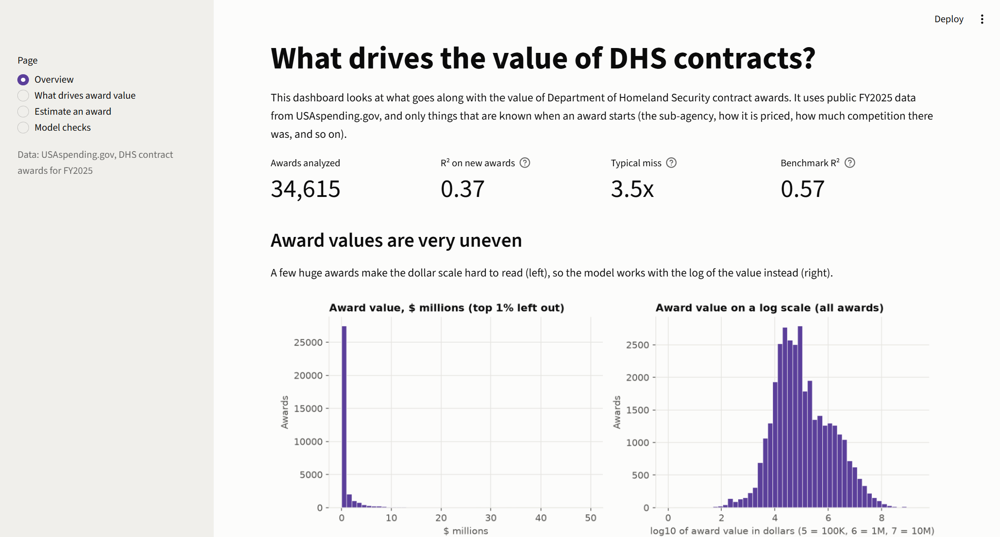
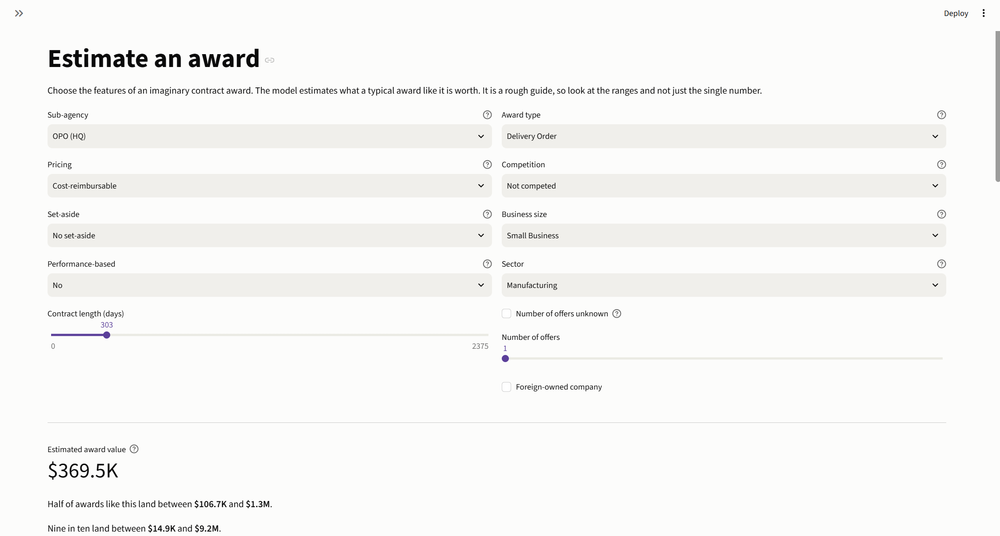
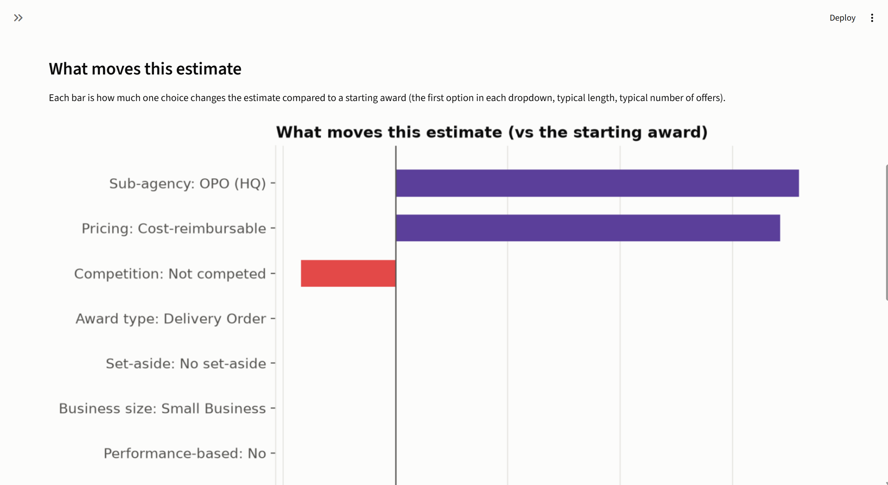
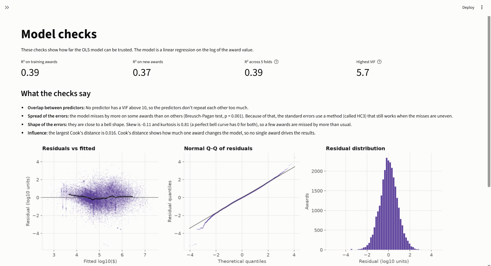

# DHS Contract Value Model

This project is a regression analysis of what features go along with the value of Department of Homeland Security (DHS) contract awards, using public FY2025 data from USAspending.gov. It also has a Streamlit dashboard where you can explore the results and estimate the value of a hypothetical award.

## Overview

The question: which features of a contract award (how long it was who bought it, how it was priced, how much competition there was) go along with larger or smaller award values?

The model uses information that is only known when an award starts, so there isn't any information from the future that could leak into the model. The results show the patterns across awards, not cause and effect.

## Data

- **Source:** [USAspending.gov](https://www.usaspending.gov), Download Center, Custom Award Data
- **Filters:** Award type = Contracts, Awarding agency = Department of Homeland Security, Fiscal year 2025
- **Size:** 55,550 contract transactions (one row for every change to a contract), which combine into 35,462 awards
- The raw data is not in this repo (the `data/` folder is ignored by git). Download your own copy and pass its path to the script.

## How it works

1. **One row per award.** The raw file has many rows for each award, so the first step is to combine them. Descriptive fields use the first row, and the award value and end date use the latest row.
2. **Filters.** Only awards with a US place of performance (35,384 awards) and a value of at least $1 (34,615 awards) are kept, so the log of the value can be taken.
3. **Target.** The log of the award value. Values go from $1 to about $2 billion, so the log makes them much more even.
4. **Predictors (41 columns).** Sub-agency, award type, pricing type, competition, set-aside, business size, performance-based contract, type of work (from the NAICS code), contract length, number of offers, and whether the company is foreign-owned. Small levels (under 1% of awards) are combined, and each category gets compared to a starting level.
5. **Left out on purpose.** The other dollar fields and the number of changes to the award. They are results of how big the award is, so they would have made the model look better than it is.
6. **Models.** OLS (fit with statsmodels, using robust standard errors), Ridge, and Lasso, plus a gradient boosting model as a benchmark. The awards were split at random into 80% for training (27,692) and 20% for testing (6,923), with seed 42.

## Results

Scores on the test awards, which the models never saw:

| Model | R² | Typical Prediction Error |
|---|---|---|
| Baseline (guess the average) | 0.00 | 5.6x |
| OLS | 0.37 | 3.5x |
| Ridge | 0.37 | 3.5x |
| Lasso | 0.37 | 3.5x |
| Gradient boosting (benchmark) | 0.57 | 2.6x |

R² is how much of the differences between award values the model explains. "Typical miss" means half of the predictions are within that many times of the real value. Ridge and Lasso score the same as OLS (Lasso kept all 41 predictors), so the penalty doesn't help here.

The strongest patterns, each compared to a starting level with the other factors the same:

| Factor | Difference in award value |
|---|---|
| Pricing vs firm fixed price | cost-reimbursable +171%, time and materials / labor hours +161% |
| Sub-agency vs Coast Guard | HQ procurement office +180%, TSA +132%, CBP +91%, FEMA -33% |
| Type of work vs manufacturing | professional and technical services +150%, construction +121% |
| Award type vs delivery order | definitive contract +159%, purchase order -40%, BPA call -34% |
| Competition vs full and open | not competed -42%, simplified competition -37% |
| Set-aside vs no set-aside | 8(a) +144%, small business about +3% (could be chance) |
| Performance-based contract | +105% |
| Other than small business vs small business | +40% |
| Foreign-owned company | -20% |
| Contract length | a 10% longer contract goes with about 4.2% larger award |
| Number of offers | 10% more offers goes with about 1.9% larger award |

The full table with intervals is in `outputs/coefficients.csv`.

## Model checks

- **Steady score:** R² is 0.39 on the training awards, 0.37 on the test awards, and 0.39 across 5 folds of the training awards.
- **Overlap between predictors:** the highest VIF is 5.7 and none are above 10.
- **Spread of the errors:** the Breusch-Pagan test says the errors are not equally spread, so the standard errors are robust (HC3).
- **Shape of the errors:** close to a bell shape (skew -0.11, kurtosis 0.81).
- **Influence:** the largest Cook's distance is 0.016, so there is no single award that drives the results.

## Dashboard









```
streamlit run app.py
```

The dashboard reads the saved results in `outputs/`, so it doesn't require the large raw data. It contains four pages:

- **Overview:** the main numbers and charts 
- **What drives award value:** how each level of a category compares to its starting level
- **Estimate an award:** select the features of an imaginary award to see an estimated value with a range, and see what moved the estimate
- **Model checks:** the checks above in plain words, also covers limitations

## How to run

```
pip install -r requirements.txt
python src/run_model.py --data data/YOUR_FILE.csv
streamlit run app.py
```

`run_model.py` may take a few minutes and saves the results and charts in `outputs/`. The results from my FY2025 run are already in this repo, so you can skip the second line and just run the dashboard.

To check that the dashboard's estimator gives the same answers as the model on real awards:

```
python src/check_estimator.py --data data/YOUR_FILE.csv
```

## Project layout

```
app.py                  Streamlit dashboard
src/features.py         raw transactions to one row per award, then the model columns
src/ols.py              OLS with statsmodels, plus the model checks
src/run_model.py        splits the data, fits the models, saves the results
src/plots.py            the charts
src/estimator.py        turns the saved results into estimates for the dashboard
src/check_estimator.py  checks the estimator against the model
outputs/                results from the FY2025 run
```

## Limits

- It covers one fiscal year (FY2025) and awards with a US place of performance.
- It shows patterns, and not a cause and effect relationship.
- The data doesn't say what is being bought and only has the type of work being done, so the estimates have wide ranges. A typical miss is 3.5x.
- Many awards come from the same parent contract or company, and the test awards were picked by a random split, so it is possible that test score could be a bit too high.
- A few levels have very few awards (business size "Unknown" has 5, and "Other competed" has 155), so those results are not reliable.

## Next steps

- Look at how much awards may grow after they begin (initial value compared to the latest value)
- Split the training and test awards by parent contract or company for stricter tests
- Try different combinations such as sub-agency and type of work to further explore the relationships
